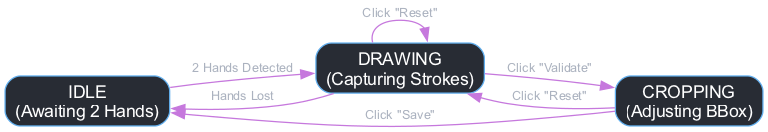
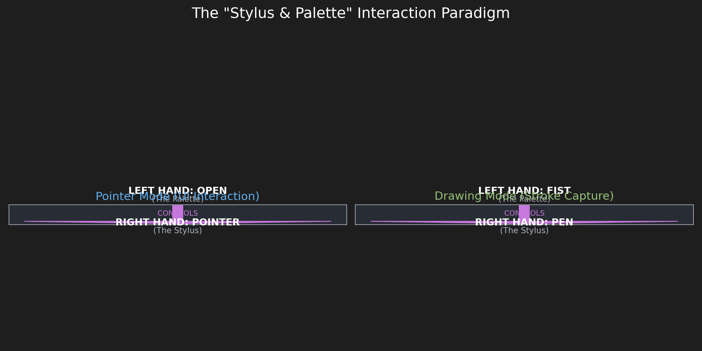

# Air Signature Pad: A Real-Time Gestural Signature System


**Author:** Yasser Bouchafra  
**Institution:** Software Engineering Student, Université Laval, Québec, Canada

---

## 1. Project Overview

**Air Signature Pad** is an advanced Human-Computer Interaction (HCI) application that transforms a standard webcam into a virtual graphics tablet. This project empowers users to draw their signature in mid-air using natural hand gestures, provides interactive tools to crop the signature precisely, and exports the final result as a high-quality PNG image with a transparent background.

Engineered for robustness, intuitiveness, and responsiveness, this system pioneers a **two-handed interaction paradigm**, a significant advancement over often-unreliable single-handed gesture systems. This design choice guarantees a fluid, unambiguous, and professional-grade user experience, making digital signature capture accessible and efficient.

## 2. Core Features

-   **Real-Time Air-Drawing:** The signature stroke is rendered in real-time, faithfully tracking the user's hand movements.
-   **Two-Handed "Stylus & Palette" Paradigm:** A dedicated hand for pointing/drawing (the "stylus") and a dedicated hand for mode-switching (the "palette") eliminates all gestural ambiguity.
-   **Robust Geometric Gesture Recognition:** Utilizes a clear, geometric definition of hand states (open palm vs. closed fist) for maximum reliability, independent of lighting conditions.
-   **Dwell-to-Click Interaction:** A precise and deliberate "click" mechanism based on a timed hover, complete with visual feedback, prevents accidental activations.
-   **Interactive Cropping Interface:** A post-drawing cropping tool allows the user to non-destructively define the exact signature area for export by interactively manipulating the corners of a bounding box.
-   **Transparent PNG Export:** The final signature is saved with a full alpha channel, producing a clean `.png` file ready for seamless overlay onto digital documents.
-   **High-Performance Architecture:** Employs multithreading for video capture (`WebcamStream` class) to decouple I/O from a computationally-intensive processing loop, ensuring a consistently smooth GUI and responsive tracking.

## 3. Technical Deep Dive

This project is an implementation of several key computer vision and software engineering principles. Its architecture is designed for modularity, stability, and real-time performance.

### 3.1. System Architecture: Finite State Machine

The application's logic is governed by a **Finite State Machine (FSM)**. This design pattern ensures that the system is always in a well-defined state, preventing unpredictable behavior. The primary states and transitions are visualized below:



-   **`IDLE`**: The initial state, awaiting user activation (presence of two hands).
-   **`DRAWING`**: The active state for capturing signature strokes. The user can validate or reset from here.
-   **`CROPPING`**: The post-capture state for adjusting the signature's bounding box. The user can save or reset from here.

The main application loop queries the current state and delegates rendering and logic to the appropriate handlers, creating a clean and maintainable codebase.

### 3.2. Hand Tracking Engine: MediaPipe

The core of the gesture recognition system is Google's **MediaPipe Hands** library.

-   It leverages a powerful Machine Learning pipeline to perform real-time detection and tracking of **21 3D landmarks** on each hand.
-   The provision of 3D coordinates (`x`, `y`, `z`) is critical. The `z` coordinate represents the depth relative to the wrist, allowing for gesture analysis that is robust to changes in hand scale and orientation. This is the foundation of our reliable two-handed interaction model.

### 3.3. The "Stylus & Palette" Interaction Paradigm

The most significant innovation in this project is the move away from single-handed interaction, which is prone to mode-switching errors (e.g., distinguishing a "pinch-to-draw" gesture from a "pinch-to-drag" gesture). The two-handed model separates concerns physically:



-   **Right Hand (The Stylus):** This hand's sole responsibility is **positioning**. The application tracks the tip of the right index finger (`landmark 8`) to control the cursor's `(x, y)` coordinates.
-   **Left Hand (The Palette):** This hand's sole responsibility is **state modification**. It acts as a modal controller, analogous to the `Shift` or `Ctrl` key on a keyboard.
    -   **State 1: Open Palm (Pointer Mode):** When the left hand is open, the right-hand cursor is a **blue pointer**. In this mode, it can interact with UI elements (buttons) via the dwell-to-click mechanism. It cannot draw.
    -   **State 2: Closed Fist (Drawing Mode):** When the left hand is closed into a fist, the right-hand cursor instantly becomes a **green pen tip**. In this mode, it leaves a trail on the canvas. It cannot interact with the UI.

This physical separation of `position` from `action` is ergonomically sound and computationally unambiguous, resulting in a zero-error interaction flow.

### 3.4. Geometric Gesture Analysis

The system determines the state of the left hand ("open" or "fist") through a direct geometric analysis of its landmarks, avoiding the need for a complex and often unreliable ML gesture classifier.

-   **Fist Detection:** A hand is classified as a "fist" if the `y`-coordinates of the fingertips of the four fingers (index, middle, ring, pinky) are numerically greater than (i.e., lower on the screen than) the `y`-coordinates of their corresponding proximal interphalangeal (PIP) joints. This is a simple, fast, and highly effective heuristic.
-   **Open Palm:** Any state that is not a "fist" is considered "open", activating the Pointer mode.

## 4. Project Structure

```
AirSignaturePad/
├── main.py                 # The main Python script for the application
├── LICENSE                 # The project's license file
└── README.md               # This documentation file
```

## 5. Prerequisites

-   Python 3.x
-   The following Python libraries:
    -   `opencv-python`
    -   `mediapipe`
    -   `numpy`
    -   `matplotlib` (for generating diagrams)
    -   `graphviz` (for generating diagrams)

## 6. Installation & Setup

1.  **Install Dependencies:** Open a terminal or command prompt and execute the following command:
    ```bash
    pip install opencv-python mediapipe numpy matplotlib graphviz
    ```
    *Note: You may also need to install the Graphviz system package (e.g., `brew install graphviz` on macOS or `sudo apt-get install graphviz` on Debian/Ubuntu).*

2.  **Generate Diagrams:** Run the diagram generation script once to create the images for this README.
    ```bash
    python generate_diagrams.py
    ```

## 7. User Guide

1.  **Launch the Application:** Execute the main script from your terminal.
    ```bash
    python main.py
    ```

2.  **Activation:** Present **both hands** to the camera. The system will detect them and transition to the interactive drawing mode.

3.  **Pointer Mode (Your "Mouse"):**
    -   **Action:** Keep your **left hand OPEN**.
    -   **Result:** A **blue cursor** appears on your right index fingertip.
    -   **Usage:** Move your right hand to position the cursor over a UI button. **Hold the cursor steady for 1 second** to "click" it. A radial progress bar provides visual feedback for the dwell action.

4.  **Drawing Mode (Your "Pen"):**
    -   **Action:** **Close your left hand into a FIST**.
    -   **Result:** The cursor on your right index finger instantly turns **green**.
    -   **Usage:** Move your right hand to draw your signature. The stroke is smooth and continuous. To lift the pen, simply open your left hand to switch back to Pointer Mode.

5.  **Cropping and Saving:**
    -   After drawing, use **Pointer Mode** (left hand open) to click the "Validate" button.
    -   A cropping rectangle appears. To grab a corner, position your cursor over it and **close your left hand into a fist**.
    -   Move your right hand to reposition the corner, then **open your left hand** to release it.
    -   Finally, use **Pointer Mode** to click the "Save" button. The signature will be saved as a unique, timestamped `.png` file with a transparent background in the project directory.

## 8. License

This project is licensed under the MIT License. See the `LICENSE` file for details.